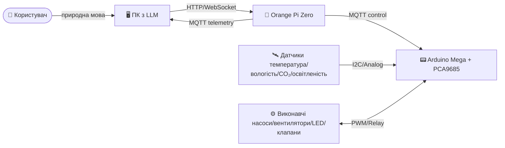
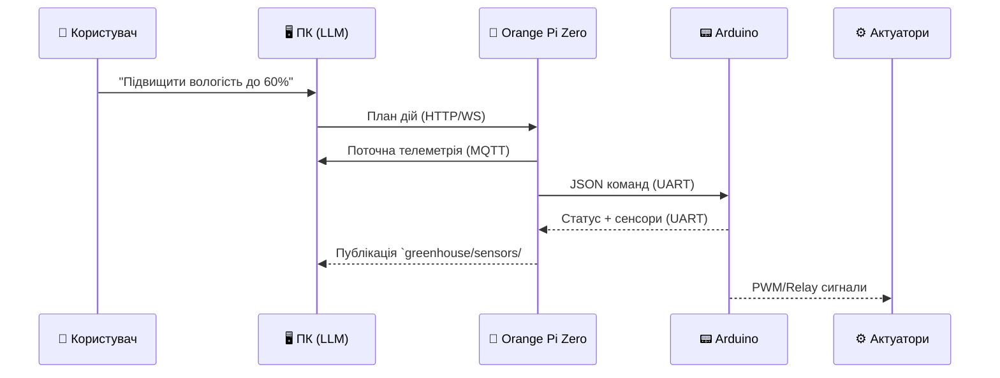

# 🌱 Smart Greenhouse Stack

Система автоматизованого вирощування зелені з LLM-координатором, який приймає інструкції природною мовою та керує поливом, світлом і мікрокліматом. Архітектура оптимізована під зв'язку між ПК, Orange Pi Zero та Arduino Mega.

---

## 🧭 Зміст
1. [Опис проекту](#-опис-проекту)
2. [Нова архітектура](#-нова-архітектура)
3. [Компоненти системи](#-компоненти-системи)
4. [Встановлення та налаштування](#-встановлення-та-налаштування)
5. [Конфігурація](#-конфігурація)
6. [Запуск системи](#-запуск-системи)
7. [Діагностика](#-діагностика)
8. [Архітектура комунікації](#-архітектура-комунікації)
9. [FAQ](#-faq)

---

## 🌿 Опис проекту

**Мета:** автоматизувати вирощування мікрозелені та салатів у компактній теплиці. Користувач формулює цілі («підвищити вологість до 60% на 2 години»), а система перетворює їх на послідовні дії.

**Ключові можливості:**
- 🤖 LLM-помічник на ПК планує режими поливу/освітлення.
- 🍊 Orange Pi Zero агрегує телеметрію та транслює команди через MQTT.
- 🔧 Arduino Mega з PCA9685 керує насосами, вентиляторами та LED-стрічками.
- 📊 Реальний час: сенсори оновлюються кожні 2–5 секунд, виконавчі пристрої реагують миттєво.

---

## 🏗️ Нова архітектура



- **Єдина логіка**: ПК планує, Orange Pi Zero маршрутизує, Arduino виконує.
- **Легка заміна**: сенсори та актуатори підключаються до Arduino без зміни верхнього рівня.

---

## 🧩 Компоненти системи

### 🖥️ ПК з LLM
- Моделі: локальна LLM (через `pc-llm-service/`) або хмарний API.
- Завдання: NLP-парсинг цілей, генерація плану поливу/освітлення, валідація аномалій.
- Інтерфейси: REST/WS до Orange Pi, MQTT для отримання телеметрії.

### 🍊 Orange Pi Zero
- Роль: шлюз та оркестратор, легкий брокер MQTT (mosquitto) + сервіс маршалізації команд (`app/`).
- Завдання: нормалізація даних сенсорів, буферизація команд, watchdog Arduino.
- Інтерфейси: Ethernet/Wi‑Fi, серійний порт до Arduino.

### 📟 Arduino Mega + PCA9685
- Роль: реального часу керування PWM/реле.
- Периферія: до 16 каналів PWM (PCA9685), до 8 аналогових датчиків, цифрові входи кінцевиків.
- Протокол: отримує JSON через UART, повертає стани та фідбек помилок.

### 🛰️ Датчики
- Температура/вологість (DHT22/SHT40), CO₂ (MH-Z19), освітленість (BH1750/ALS), рівень води (флоат/ультразвук).
- Підключення: I2C/Analog до Arduino, публікація в MQTT раз на 2–5 секунд.

### ⚙️ Виконавчі пристрої
- Насоси (дренаж/полив), вентилятори, обігрів/охолодження, LED-стрічки.
- Керування: PWM (яскравість LED, швидкість вентиляторів) або реле (насоси/клапани).

---

## 🛠️ Встановлення та налаштування

### На ПК
```bash
# 1) Клонування
git clone https://github.com/your-org/opi-zero-stack.git
cd opi-zero-stack

# 2) Підготовка LLM сервісу
cd pc-llm-service
python -m venv .venv && source .venv/bin/activate
pip install -r requirements.txt
# Налаштувати доступ до моделі (локальна або API ключ у .env)

# 3) Docker (за потреби брокер/емулятори)
docker compose -f docker-compose.pc.yml up -d
```

### На Orange Pi Zero
```bash
# 1) Пакети
sudo apt update && sudo apt install -y python3 python3-venv docker.io docker-compose-plugin
sudo usermod -aG docker $USER && newgrp docker

# 2) Клонування
cd ~ && git clone https://github.com/your-org/opi-zero-stack.git
cd opi-zero-stack

# 3) MQTT брокер + сервіс маршалізації
cp app/.env.example app/.env
sed -i 's/MQTT_HOST=.*/MQTT_HOST=localhost/' app/.env
sudo docker compose up -d mqtt app
```

### На Arduino
```bash
# Підготовка середовища
sudo apt install -y arduino-cli
arduino-cli core install arduino:avr
arduino-cli lib install "Adafruit PWM Servo Driver Library" "ArduinoJson"

# Збірка та прошивка (заміни ttyACM0 на свій порт)
cd firmware
arduino-cli compile --fqbn arduino:avr:mega robotarm.ino
arduino-cli upload -p /dev/ttyACM0 --fqbn arduino:avr:mega robotarm.ino
```

---

## ⚙️ Конфігурація

### Мережеві налаштування
- Статичні IP у локальній мережі для ПК та Orange Pi (`192.168.x.x`).
- Відкриті порти: `1883` (MQTT), `8000` (API Orange Pi), `11434` (LLM demo), `22` (SSH).
- Синхронізація часу: `systemd-timesyncd` або `chrony` на всіх вузлах.

### MQTT
- Брокер mosquitto запускається на Orange Pi (`docker compose up -d mqtt`).
- Топіки за замовчуванням:
  - `greenhouse/sensors/#` — телеметрія (json payload).
  - `greenhouse/cmd/actuators` — команди на Arduino.
  - `greenhouse/llm/goals` — цілі від користувача.
  - `greenhouse/events` — алерти/аномалії.

### Змінні оточення
Приклад `app/.env` для Orange Pi:
```env
MQTT_HOST=localhost
MQTT_PORT=1883
SERIAL_PORT=/dev/ttyACM0
SERIAL_BAUD=115200
FALLBACK_MODE=manual    # manual | auto | safe
HUMIDITY_TARGET=60
LIGHT_CYCLE=16h_on_8h_off
```

Приклад `.env` для ПК (LLM):
```env
LLM_PROVIDER=openai
OPENAI_API_KEY=sk-...
MQTT_HOST=192.168.1.220
MQTT_PORT=1883
PLAN_HORIZON_MIN=120
```

---

## ▶️ Запуск системи

1) **Запустити брокер та шлюз на Orange Pi**
```bash
cd ~/opi-zero-stack
sudo docker compose up -d mqtt app
```

2) **Запустити LLM-сервіс на ПК**
```bash
cd pc-llm-service
source .venv/bin/activate
uvicorn api:app --host 0.0.0.0 --port 11434
```

3) **Перевірити зв'язок**
```bash
# На Orange Pi або ПК
mosquitto_sub -h 192.168.1.220 -t 'greenhouse/events' -v &
mosquitto_pub -h 192.168.1.220 -t 'greenhouse/events' -m '{"ping":true}'
```

4) **Старт робочого циклу**
- LLM надсилає план у `greenhouse/llm/goals`.
- Orange Pi транслює в `greenhouse/cmd/actuators` у форматі JSON.
- Arduino виконує та повертає стани в `greenhouse/sensors/state`.

---

## 🩺 Діагностика

- Перевірка здоров'я Orange Pi API:
```bash
curl http://192.168.1.152:8000/healthz
```

- Журнали сервісів Docker на Orange Pi:
```bash
sudo docker compose logs -f app mqtt
```

- Моніторинг серійного трафіку Arduino:
```bash
sudo screen /dev/ttyACM0 115200
```

- Тест команд до Arduino через MQTT:
```bash
mosquitto_pub -h 192.168.1.220 -t 'greenhouse/cmd/actuators' \
  -m '{"pump_main":1, "fan_left":128, "led_white":200}'
```

---

## 🔗 Архітектура комунікації



**Формат команди до Arduino (UART / MQTT payload):**
```json
{
  "pump_main": 1,
  "fan_left": 128,
  "led_white": 180,
  "mister": 1,
  "deadline_ms": 5000
}
```

**Формат телеметрії:**
```json
{
  "ts": 1731000000,
  "temperature": 23.8,
  "humidity": 59.4,
  "co2": 680,
  "light": 320,
  "water_level_ok": true,
  "errors": []
}
```

---

## ❓ FAQ

**Як задати ціль природною мовою?**  
Надішліть текст у REST/WS ендпоінт LLM-сервісу (`POST /goals`). Він сформує план і опублікує його в MQTT.

**Що робити при обриві зв'язку з Arduino?**  
Orange Pi переходить у `safe` режим: вимикає насоси, залишає вентилятори на мінімумі та шле алерт у `greenhouse/events`.

**Як швидко змінити порти або хости?**  
Оновіть `app/.env` і `.env` на ПК, перезапустіть відповідні сервіси Docker/uvicorn.

**Чи потрібна GPU?**  
Ні, LLM може бути маленькою (Q4), а управління в реальному часі виконує Arduino.

**Як додати новий сенсор?**  
Підключіть до Arduino, додайте обробку в прошивку (розділ `readSensors()`), Orange Pi автоматично підхопить нове поле з JSON.

